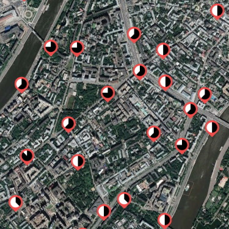

# VeloKML

Список парковок [московского велопроката Velobike](https://velobike.ru/) в виде KML-файла, совместимого с Google Earth! (PHP-скрипт)

* Превращает официальный список в KML-файл на лету - всегда последние данные.
* Иконки для загруженности парковок, [как в Velocheck](https://github.com/himselfv/velocheck/).

В Google Earth и других программах можно подключать внешние KML-ссылки (Правой клавишей - "Добавить ссылку"). Их содержимое обновляется время от времени. Если вы укажете адрес такого скрипта, у вас на карте всегда будут свежие парковки!
